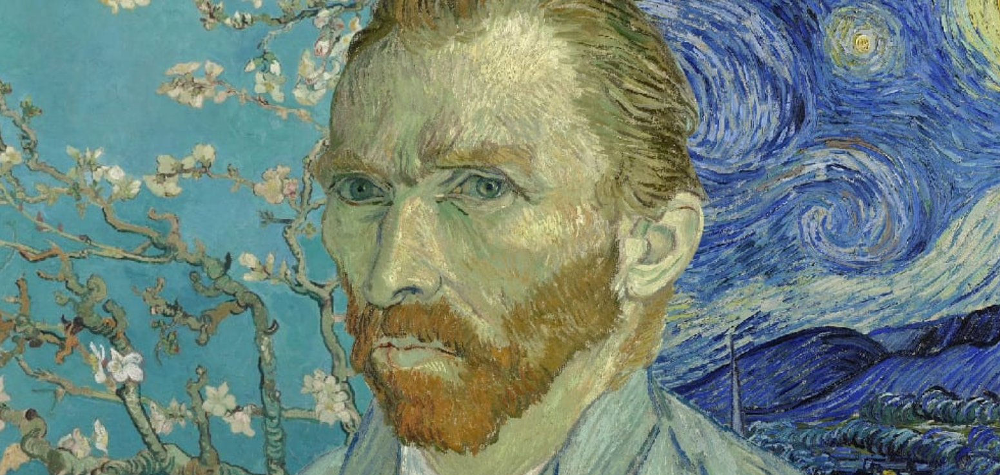

# Vincent Van Gogh

This website was developed for people who want to find out more about Vincent Van Gogh and people who admire and appreciate his work. Users of this website can find information about Vincent Van Gogh's life in the about section, an artist timeline details significant events in Vincent Van Gogh's life and a video is available which contains more details about the artist and his life. In the gallery, users can browse some of the paintings by Vincent Van Gogh and users may opt in to sign up to a newletter to have more information sent to them about the artist Vincent Van Gogh. This website was designed to be a hub for a community of people who have a shared intrest in Vincent Van Gogh. 

A live version of the project can be accessed here: [Vincent Van Gogh](https://leoniemclaughlin7.github.io/Vincent-Van-Gogh/)

# Table Of Contents

# User Experience Design

## User Demographic

This website is intended for:

* Users that have a keen intrest in Vincent Van Gogh.
* Users that would like to find out more information on Vincent Van Gogh.
* Users that wish to become part of a community who appreciate the work of Vincent Van Gogh. 

## User Stories

As a User of this website:

* I want to find information about Vincent Van Gogh.
* I want to admire some of the work carried out by vincent Van Gogh. 
* I want to be able to obtain additional information surrounding Vincent Van Gogh. 
* I want to join a collective community of Vincent Van Gogh lovers.

# Features 

The Vincent Van Gogh website contains three main pages, which can be navagated too via a navigation bar that is fixed to the top of the page as the user scrolls. Each page contains a header with the navagation bar and a footer. The three main pages in this design are:

* Home/about section.
* Gallery.
* Sign up page. 

## Existing Features

### Header and Navigation Bar 

* Featured on all three pages, the header contains a clickable logo, that will return the user to the home page and a responsive navigation bar. 
* The navigation bar allows the user to move around the website and includes links to Home, About, Gallery and Sign up pages. A border can be seen on the page that the user is currently on. 
* The header is identical across all three pages which enhances usability and consistency.

### Hero Image 

* The landing page contains a hero image, this is a picture of Vincent Van Gogh with some of his most famous work in the background.
* This image was choosen as it represents what this website is about. The colour scheme for the website was also derived from this hero image. 

### About Section

* The about section contains vital information for the user about the artists life and work. In order to display the information but keep it minimal, the information is displayed in two responsive boxes that fit with the colour scheme. 

### Artist Timeline

* The artist timeline is a responsive scrollable horizontal feature that gives the user more information releating to Vincent Van Gogh's life and events that happens in his life.

# Credits
Hero image
https://supergreeks.eu/vincent-van-gogh-olllandia/ 

resources

help with flexbox
https://www.youtube.com/watch?v=Q1d-1FzdXEE 

inspiration for timeline
https://stackoverflow.com/questions/34048063/how-to-create-simple-horizontal-timeline 

youtube video
https://www.youtube.com/watch?v=3q5fuVFWe0Q

van gogh images
https://www.vangoghmuseum.nl/en/art-and-stories/art/vincent-van-gogh#paintings

