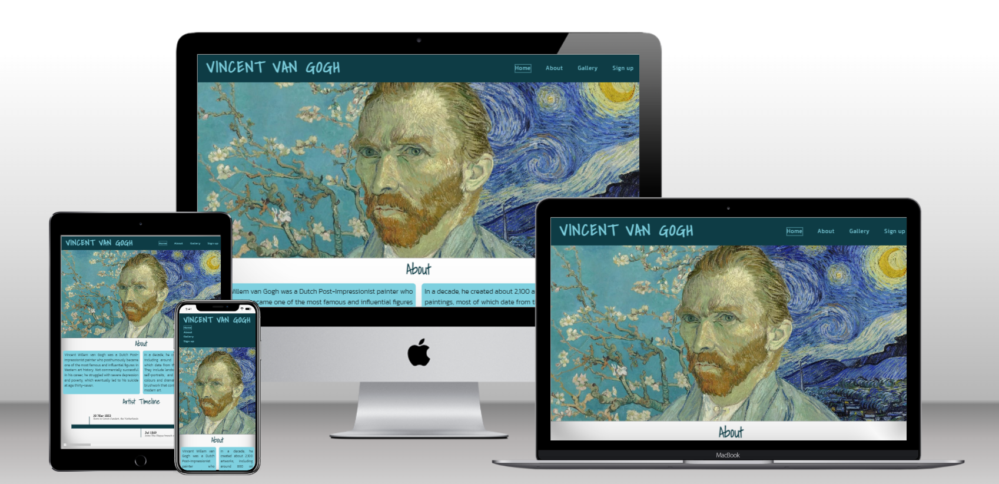
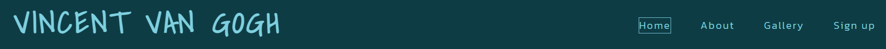
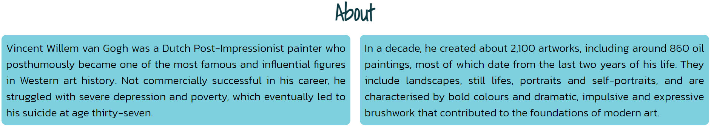
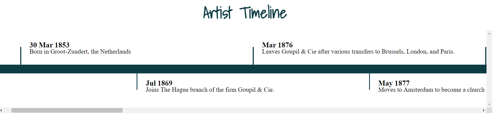
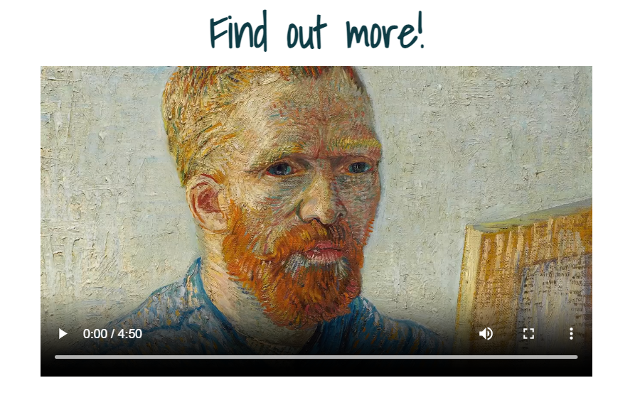
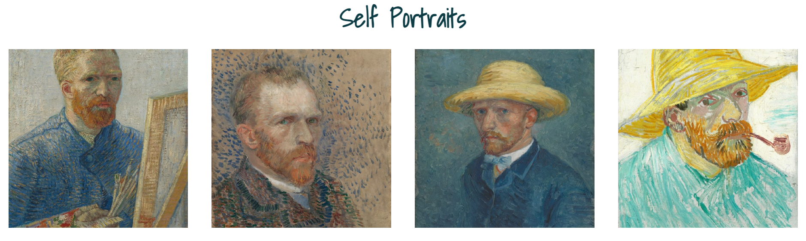
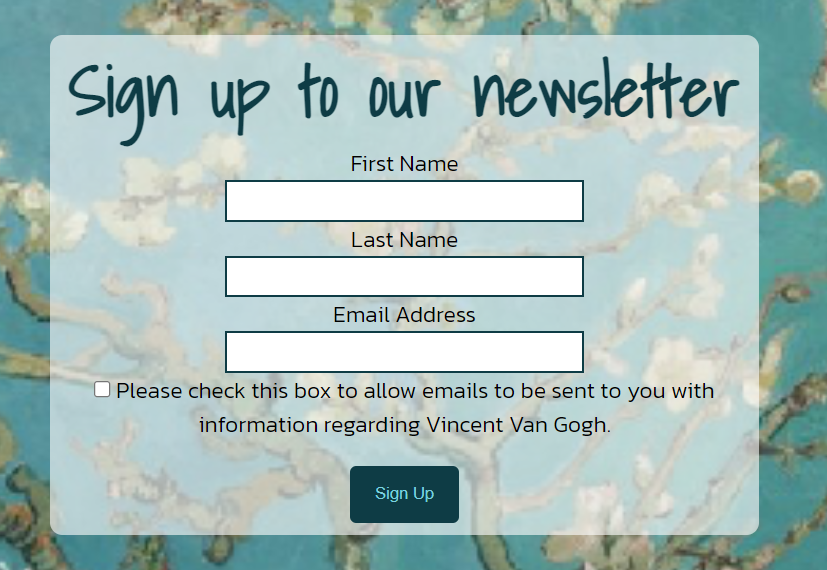
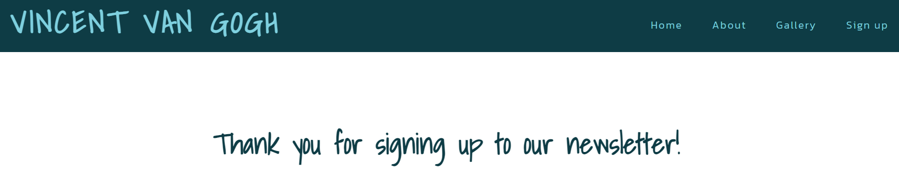

# Vincent Van Gogh

This website was developed for people who want to find out more about Vincent Van Gogh and people who admire and appreciate his work. Users of this website can find information about Vincent Van Gogh's life in the about section, an artist timeline details significant events in Vincent Van Gogh's life and a video is available which contains more details about the artist and his life. In the gallery, users can browse some of the paintings by Vincent Van Gogh and users may opt in to sign up to a newletter to have more information sent to them about the artist Vincent Van Gogh. This website was designed to be a hub for a community of people who have a shared intrest in Vincent Van Gogh. 

A live version of the project can be accessed here: [Vincent Van Gogh](https://leoniemclaughlin7.github.io/Vincent-Van-Gogh/)

# Table Of Contents

# User Experience Design

## User Demographic

This website is intended for:

* Users that have a keen intrest in Vincent Van Gogh.
* Users that would like to find out more information on Vincent Van Gogh.
* Users that wish to become part of a community who appreciate the work of Vincent Van Gogh. 

## User Stories

As a User of this website:

* I want to find information about Vincent Van Gogh.
* I want to admire some of the work carried out by vincent Van Gogh. 
* I want to be able to obtain additional information surrounding Vincent Van Gogh. 
* I want to join a collective community of Vincent Van Gogh lovers.

# Features 

The Vincent Van Gogh website contains three main pages, which can be navagated too via a navigation bar that is fixed to the top of the page as the user scrolls. Each page contains a header with the navagation bar and a footer. The three main pages in this design are:

* Home/about section.
* Gallery.
* Sign up page. 

## Existing Features

### Header and Navigation Bar 

* Featured on all three pages, the header contains a clickable logo, that will return the user to the home page and a responsive navigation bar. 
* The navigation bar allows the user to move around the website and includes links to Home, About, Gallery and Sign up pages. A border can be seen on the page that the user is currently on. 
* The header is identical across all three pages which enhances usability and consistency.

### About Section

* The about section contains vital information for the user about the artists life and work. It is comprised of three sections to include a general about section, artist timeline and a video containing more information for the user.  
* In order to display the information but keep it minimal, the first part of the about section is displayed in two responsive boxes that fit with the colour scheme. 

#### Artist Timeline

* The artist timeline is a responsive scrollable horizontal feature that gives the user more information releating to Vincent Van Gogh's life and events that happens in his life.

#### Video

* The final section of the about section includes a video. This video gives the user more detail about Vincent Van Gogh, his life and work. 
* This video will not autoplay, instead it is up to the user to decide to play the video. It is appropriate to the website and is informative for users. 

### Gallery 

* The gallery is an important aspect of this website. It is within this section that some of Vincents Van Gogh's paintings are displayed to the user.
* There is three distinct categories of paintings available to view, self-portraits, landscapes and flowers. When hovered over the paitings enlarge slightly and a drop shadow can be seen. 

### Sign Up 

* The sign up page allows users to sign up to a newsletter that will supply them with more information regarding Vincent Van Gogh. 
* The sign up page is comprised of three input feilds and a checkbox, it contains form validation, in that either of the text feilds must not be empty. The email feild must contain an email and the checkbox must be checked before the form is submitted. 

### Form Submission Page

* When the user submits the sign up form they are redirected to a thank you page. 
* This gives an indication to the user that their form has been recieved and that they have signed up for the newsletter.

## Features Left to Implement 

* A user profile could be implemented to allow the user to sign in to the website.
* It would be nice to add a feature that allows the user to favorite a painting.
* The addition of adding and viewing reviews of the paintings would be a nice feature to add.
* More of the work carried out by Vincent van Gogh could be added to the gallery. 

[Back to top](#vincent-van-gogh)

# Testing 

Testing of the functionality of the website can be seen in the following tables. Each section of the website has been tested according to the feature and testing different devices and screen resolutions has been conducted using Google DevTools. 

## Navigation Bar 

|Feature  | Expect  | Action | Result | 
|--|--|--|--|
| Logo  | When the logo is clicked it will return the user to the home page |Clicked logo | pass
| Home nav button| When clicked it will direct the user to the home page |Clicked Home on the nav bar | pass
|About nav button| When clicked it will direct the user to the about section |Clicked About on the nav bar | pass
|Gallery nav button| When clicked it will direct the user to the gallery page |Clicked Gallery on the nav bar | pass
| Sign up nav button| When clicked it will direct the user to the sign up page |Clicked Sign up on the nav bar | pass
|Nav menu responsive at 909px|When browser is resized to 909px or below the nav menu will relocate to under the logo |Resized browser to 909px | pass
|Nav menu responsive at 588px|When browser is resized to 588px or below the nav menu will stack under the logo |Resized browser to 588px | pass

## Hero Image 

|Feature | Expect | Action | Result |
|--|--|--|--|
|Hero image responsive |When the screen size is changed the image does not distort and fits to screen|Resized browser and checked hero image at different screen resolutions | pass

## About Section 

|Feature | Expect | Action | Result |
|--|--|--|--|
|About boxes responsive |When the screen size is changed the about boxes fit to screen size|Resized browser and checked about boxes at different screen resolutions | pass
|About boxes responsive at 449px and below |When the screen size is changed  to 449px and below the about boxes font size changes to 100%|Resized browser to 449px and checked the font size of about boxes| pass
|Timeline |The timeline is scrollable |Scroll to end of the timeline| pass
|Timeline is responsive|The timeline is responsive on all screen sizes |Resize browser and checked timeline is responsive of different screen sizes| pass
|Video |The video does not auto play |Refreshed browser and confirm that the video does not play without action for the user| pass
|Video is responsive |The video will be 70% of the page on all screen sizes |Resized the browser and checked the video is responsive on all screen sizes| pass

# Deployment 

The site was deployed to GitHub pages. The steps to deploy are as follows:
1. Navigate to GitHub.
2. Choose the desired GitHub repository.
3. Select settings from the top menu bar.
4. On the left hand side, under the code and automation section, choose pages. 
5. Under the build and deployment heading, set branch as main and click save.
6. The website will deploy, a link to the project will be seen at the top of the page. 

The live link can be accessed here: [Vincent Van Gogh](https://leoniemclaughlin7.github.io/Vincent-Van-Gogh/)

# Credits
Hero image
https://supergreeks.eu/vincent-van-gogh-olllandia/ 

resources

help with flexbox
https://www.youtube.com/watch?v=Q1d-1FzdXEE 

inspiration for timeline
https://stackoverflow.com/questions/34048063/how-to-create-simple-horizontal-timeline 

youtube video
https://www.youtube.com/watch?v=3q5fuVFWe0Q

van gogh images
https://www.vangoghmuseum.nl/en/art-and-stories/art/vincent-van-gogh#paintings

